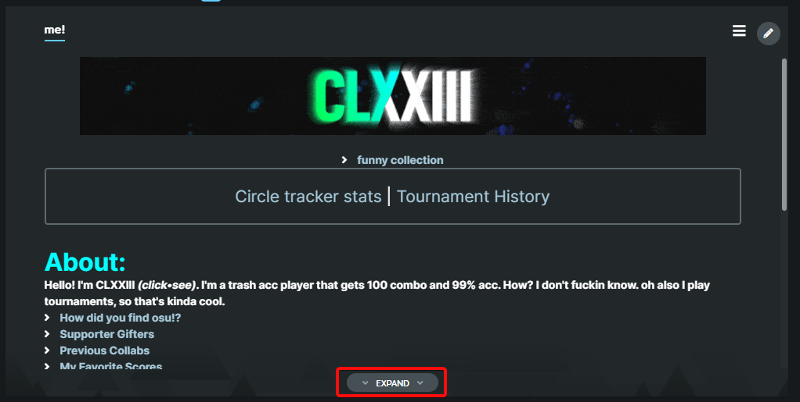

# expand-me-page
Adds a button at the end of the me! section to expand the me! page to the length of the content

## Prerequisites
- Tampermonkey for Chrome or Greasemonkey for Firefox

## How to install
Ensure you have Tampermonkey/Greasemonkey installed and enabled. 

* Click [here](https://github.com/clxxiii/expand-me-page/raw/master/expand-me-section.user.js) to install the script.
* Click [here](https://github.com/clxxiii/expand-me-page/raw/master/expand-me-section-noclick.user.js) to a version that expands the me! without clicking (no button).

## Issue Reporting

This script was made in about 3 hours, so there's bound to be compatibility issues. If you run into any issues Please report them using [the GitHub issue tracker](https://github.com/clxxiii/expand-me-page/issues/new)
